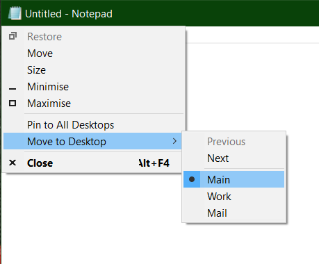

<!--  Desktops Menu -->
 Desktops Menu
==========

Adds items to the windows system menu for virtual desktops


[](https://github.com/RadAd/DesktopsMenu/releases/latest)
[](commits/master)
[](https://ci.appveyor.com/project/RadAd/DesktopsMenu)



Build
=======
```bat
msbuild DesktopsMenu.vcxproj -p:Configuration=Release -p:Platform=x86
msbuild DesktopsMenu.vcxproj -p:Configuration=Release -p:Platform=x64
```
Run
=======
```bat
rundll32.exe Bin\Win32Release\DesktopsMenu.dll,DesktopsMen
rundll32.exe Bin\x64Release\DesktopsMenu.dll,DesktopsMenu
```
